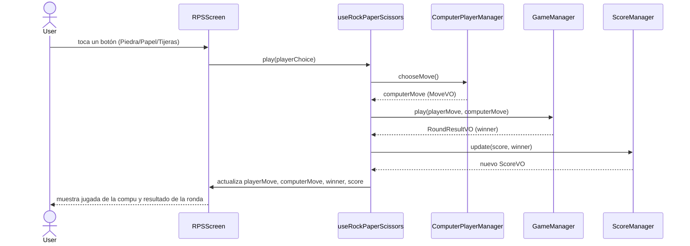

# Piedra, Papel o Tijeras

Este proyecto fue creado con Expo usando el siguiente comando:

npx create-expo-app@latest rps-game --template blank

La app usa el template "blank" de Expo, que da una estructura mínima de proyecto React Native lista para correr y personalizar.

Esta aplicación replica la metodología del curso "Integración de seguridad informática en redes y sistemas de software", aplicada a un juego de Piedra, Papel o Tijeras (jugador humano vs. computadora).

## ¿Qué es React Native?
React Native es un framework para construir aplicaciones móviles usando JavaScript y React. Permite crear apps con apariencia nativa para iOS y Android desde una sola base de código.

## ¿Qué es Expo?
Expo es un conjunto de herramientas y servicios construidos sobre React Native que hacen el desarrollo móvil más rápido y sencillo. Provee un "managed workflow", librerías preconstruidas, y una forma simple de correr y probar apps en dispositivos y simuladores.

## ¿Qué es React Native Paper?
React Native Paper es una librería de UI para React Native que provee componentes listos para usar (botones, inputs de texto, tipografía) siguiendo Material Design. Ayuda a construir una interfaz más pulida y consistente sin tener que crear cada elemento visual desde cero.

## Librerías agregadas al proyecto
- **React Native Paper**: agregada para dar componentes Material Design a la pantalla del juego.
- **React Native Safe Area Context**: agregada para manejar las áreas seguras en dispositivos con notch o esquinas redondeadas.
- **Jest + jest-expo**: agregadas para poder escribir y correr los tests unitarios del Model con TDD.

Instaladas con:

```
npx expo install react-native-paper react-native-safe-area-context
npx expo install jest jest-expo
```

### Nota importante sobre cómo instalar dependencias nuevas

En este proyecto, para paquetes que tocan código nativo (Expo, React Native, y librerías asociadas como las de arriba), usar **`npx expo install <paquete>`** en vez de `npm install <paquete>`.

¿Por qué? `npm install` trae la última versión publicada en npm, que puede no ser compatible con la versión del SDK de Expo instalada en el proyecto — eso generó justamente un conflicto de peer dependencies (`ERESOLVE`) al instalar `jest`/`jest-expo` con `npm install`, y una advertencia de versión incompatible con `react-native-safe-area-context`. `npx expo install` en cambio consulta qué versión de cada paquete es compatible con el SDK actual y la instala directamente, evitando el problema.

Paquetes que no tocan código nativo (librerías puramente de JS) sí se pueden instalar con `npm install` normal.

## Estilado con React Native Paper
Los componentes de React Native Paper se estilan con la prop `style`, igual que cualquier otro componente de React Native. En este proyecto los estilos se definen con `StyleSheet.create({...})` al final de cada componente, exportados como constante `styles`.

## Test Driven Development (TDD)
TDD es un enfoque de desarrollo donde primero se escriben los tests y después se agrega la implementación necesaria para que pasen. En este proyecto, toda funcionalidad nueva sigue TDD: primero se agrega/actualiza el test correspondiente, se corre la suite para confirmar que falla (red), y recién ahí se implementa el mínimo cambio necesario para que pase (green). Los tests usan comentarios `// GIVEN` / `// WHEN` / `// THEN` para marcar cada parte del caso.

## Patrón MVC en este proyecto
- **Model** (`models/`): contiene la lógica de negocio y las estructuras de datos, sin ninguna dependencia de React. Las reglas del juego (quién le gana a quién, el marcador) viven en los `managers/`, y los datos con forma fija (una jugada, un resultado de ronda, el marcador) viven en los `valueobjects/`.
- **View** (`screens/` + `App.js`): es lo que el usuario ve y toca. La pantalla del juego renderiza los botones y el resultado, sin lógica de negocio propia.
- **Controller** (`hooks/`): maneja el flujo entre la View y el Model. El custom hook `useRockPaperScissors` recibe la jugada del usuario, invoca la lógica del juego, y actualiza el estado que la pantalla muestra.

### Diagrama de secuencia UML del flujo de la aplicación



Este diagrama usa sintaxis Mermaid para representar la interacción entre el usuario, la pantalla, la lógica del controlador y la capa de modelo en un flujo de secuencia estilo UML.

## Correr los tests

```
npm test
```

## Entorno usado
- Node.js: v26.7.0
- npm: 11.19.0
- Expo SDK: ~54.0.36
- React Native: 0.81.5

Se usó Expo SDK 54 porque es la versión configurada actualmente en las dependencias del proyecto y es compatible con el stack moderno de Expo/React Native que usa esta app.

## Correr la aplicación

Instalar dependencias:

```
npm install
```

Levantar el servidor de desarrollo de Expo:

```
npm start
```

Esto abre las Expo developer tools en el navegador y da un código QR para probar en un dispositivo.

## Correr en emulador de Android Studio

1. Abrir Android Studio.
2. Levantar un emulador de Android.
3. En la terminal, correr:

```
npm run android
```

Expo se conecta al emulador que esté corriendo y levanta la app ahí.

## Correr en simulador de Xcode

1. Abrir Xcode.
2. Levantar un simulador de iOS.
3. En la terminal, correr:

```
npm run ios
```

Expo compila y levanta la app en el simulador de iOS.

## Correr con Expo Go

1. Instalar Expo Go en el celular desde App Store o Google Play.
2. Asegurarse de que el celular y la computadora estén en la misma red.
3. Correr:

```
npm start
```

4. Escanear el código QR que aparece en la terminal o el navegador con Expo Go.

## Notas

Si además querés abrir la app en el navegador, podés correr:

```
npm run web
```
